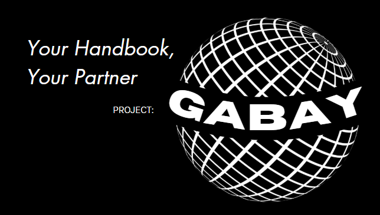

# Gabay - *Guided Assistance for Behavior & Academic Yield*

This program utilizes official PSHS Code of Conduct and PSHS Handbook data to create structured responses 
for questions about the conduct.

This shall serve as Camp Tapilak's submission for the 2026 PSHS AI Hackathon. 

The program is designed via a client and server architecture, with a Vercel frontend and a Colab backend to run
the AI Model.

# Technologies Used
- **Frontend**: Vercel, React
- **Backend**: Google Colab, Python
- **LLM Model**: Ollama LLaMA 3.2 1B
- **Vector Embeddings**: nomic-embed-text
- **Data Sources**: PSHS Code of Conduct, PSHS Handbook
